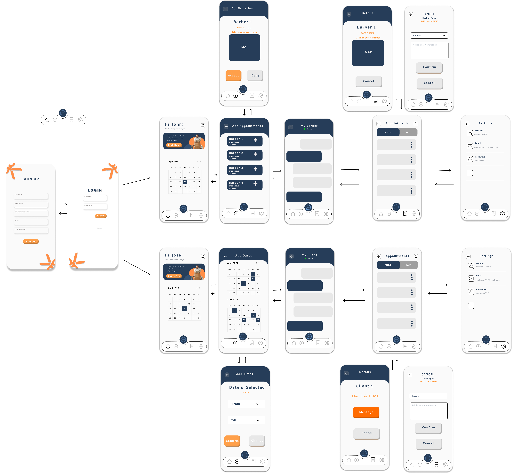
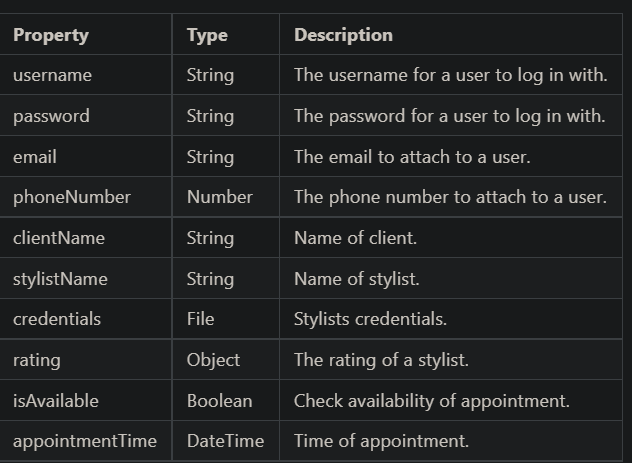

# Barber Shop Appointments

## Table of Contents
1. [Overview](#Overview)
1. [Product Spec](#Product-Spec)
1. [Wireframes](#Wireframes)
2. [Schema](#Schema)

## Overview
### Description
An application meant to provide a convenient way for customers to schedule barbershop appointments without the typical hassle one might find when attempting to regularly request an appointment.

### App Evaluation
- **Category:** Business/Communication/Social/Lifestyle

-  **Mobile:** Application would be intended for mobile use, however, it would be just as effective on computers or other devices. In terms of functionality, there really wouldn’t be any major limitations between the features shown on a computer and a mobile device. The only minimal limitations, that would have to be resolved via the users-end, arise from the features which may use certain mobile-oriented services such as phone calls or SMS.

-  **Story:**  Creates, manages, and notifies clients/stylists of appointments made via the app. This also includes the management and notification of cancelled or rescheduled appointments.

- **Market** Any user can sign up to be a client or stylist, however, to keep the app safe and reliable, stylists would have to submit documentation(ex: certification).

- **Habit:** This app would be very handy for customers and stylists to have direct contact with both parties and be instantly notified of updates. It also minimizes the time lost for stylists waiting for customers that rescheduled or cancelled.

- **Scope:** This application will first be based around a single barbershop, then progress to a larger barbershop franchise/community, and lastly move on to a platform where any barbershop business of any size can set up an account to schedule with clients

## Product Spec

### 1. User Stories (Required and Optional)
**Required Must-have Stories**

* Users can create a new account or login
* Selection of stylist or client

| Client can request a new scheduled appointment  | Stylists will be alerted when new appointments are created  |
| :-: | :-: |
| In the new appointment page, the user can select a stylist |  Option to accept or reject the requestappointment |

| Confirmation Screen/Rejection Screen |
 

 
* Both receive alerts as the appointment approaches 
* Both have the ability to or cancel or request to reschedule within a certain timeframe(if cancelled too close to the appointment then their “fulfillment” rate will decrease )

**Optional Nice-to-have Stories**
* Integration with Google or other social media platform in order to register
* Navigation implementation
* Before selecting a stylist on the new appointment page, the user can select one of the locations within the franchise (when the app reaches that level)
* Chat system 

### 2. Screen Archetypes
**Login Screen**

* Client/Stylist can login or register 

**Menu Screen**

| Client can request new appointment with specfic stylist  | Stylist will be able to specify dates & times available |
| :-: | :-: |
| |  Option to accept or reject the request appointment |

                         
*Both will see any upcoming appointments made(within 7 day time period)

**‘Receipt ’screen**

* Both will be able to view all upcoming or past appointments
* Both will be able to cancel or request to reschedule any upcoming appointments

**Settings**
* Allows switch between client and stylist 
* Allows stylist to upload certification documentation 

**Account**
* Allows both to input information such as a phone number or email

### 3. Navigation
**Tab Navigation (Tab to Screen)**
* Account
* Menu
* ‘Receipt ’
* Settings

**Flow Navigation (Screen to Screen)**
* Forced Login -> Account creation if no login is available
* Account → Text fields to edit
* Menu → Toggle/add appointments
* ‘Receipt’ → View (past and future)appointments/ Toggle upcoming appointments
* Settings → Toggle settings

## Wireframes

### [BONUS] Digital Wireframes & Mockups
-Figma Link :https://www.figma.com/file/L6wGDvDPxSkRADO3jKqbNe/Untitled?node-id=9%3A439

## Schema 

**Data Model

#Networking
* Login Screen
    * (GET) Username and Password
* Sign Up Screen
    * (POST) Create new user
    * (GET) Gets list of users to see if user already exists
* Client Home Screen
    * (GET) Gets available Stylists availability times and scheduals
    * (PUT) Selects an availability slot
    * (PUT) Cancel an appointment
    * (PUT) Update clients profile
* Stylists Home Screen
    * (POST) Post availablity times and schedual
    * (GET) Upcoming Appointments
    * (PUT) Cancel or request reschedule
    * (DELETE) Delete an availabilty time/ schedual [Before an appointment is made]
    * (PUT) Update stylists profile
* Chat Screen
    * (POST) Add a text
    * (GET) Read text
* Cancel Appointment Screen
    * (DELETE) Delete an Appointmentelp] 
